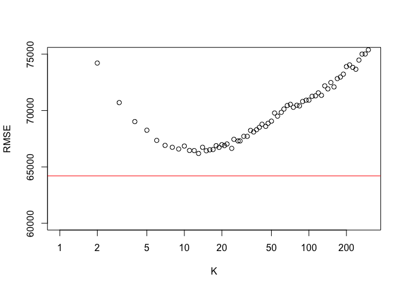

Exercise 2
================
Alex Rados, Sri Jonnalagadda, Kenny Kato

# Saratoga Housing Prices

## Overview

The goal at hand is determining a good model for predicting future house
prices in Saratoga, New York in order to know how much to tax property
owners for the local taxing authority.

## Data

We will be looking at past Saratoga housing prices to gather reasonable
expectations of the effects that house characteristics will have on
future price. Some of the variables at hand are age of the house (in
years), percentage of residents in the neighborhood with a college
degree, number of bedrooms and bathrooms, among many others.

Using these variables to fit both linear and non-parametric models, we
are trying to fit the most accurate model when predicting house prices.
This can be measured in the form of the root mean-squared error (RMSE)
of that specific model.

In order to generate the most accurate predictions, however, we can’t
judge it based on past data that we have. Thus, we randomly sampled 80%
of the data at hand and used that as a training set on which we built
our model while using the other 20% as a test set on which we tested our
model to gather a sufficient RMSE. This then allows us to measure the
out-of-sample performance.

Finally, to address the issue of random variation with the selection of
data points that end up in our train/test split, we ran a do-loop. This
averaged the estimate of out-of-sample RMSEs over 500 different random
train/test splits, to which we felt comfortable with the lack of random
variation in the results that were being generated.

## Linear Model

I initially began with a linear model that predicted price using age,
percentage of college graduates in the neighborhood, size of the lot (in
acres), number of bedrooms, bathrooms, and total rooms, living area of
the house (in square feet), number of fireplaces, type of heating
system, type of fuel system, and whether there was central air
conditioning. This produced a lower RMSE, around 66,000, than either a
smaller model (just lot size, bedrooms, and bathrooms) or a larger model
(all these variables and every interaction between them).

    ## [1] 66754.49

Going off this model, we attempted to improve the RMSE through
selections of specific interaction and adding/subtracting variables.
After going through a muiltitude of subtractions, additions, and
interactions, we finally settled on a model that improved the RMSE from
around 66,000 to about 64,000.

First, we made an adjustment to the data in creating an extra rooms
variable that was the total amount of rooms minus the bedrooms and
bathrooms, as before in the regression the variable total rooms would’ve
included two other features already in the model. Thus, we added in
extra rooms and took out the total rooms.

We then added interactions between bedrooms and bathrooms, bathrooms and
extra rooms, and bedrooms and extra rooms. We also included whether
there was new construction on the house, along with whether the property
is on the water front. Adding in new construction and the interactions
improved the RMSE by 300. The most impressive additional variable beyond
the initial model was waterfront, which dropped the RMSE by about 2,000.
This is the linear model that we decided on.

    ## [1] 64206.97

## Non-Parametric Model

Next, we wanted to try to improve upon the linear fit by building a
non-parametric K nearest neighbors model that uses those same variables
to derive better performance. We ran a do-loop around the KNN
assignments in order to get rid of the random variation in terms of
choosing the train/test
splits.

<!-- -->

    ## [1] 75381.03

    ## [1] 64206.97

## Conclusion

We found that a non-parametric model was not able to improve upon our
linear fit. The KNN method of modeling resulted in a consistently higher
RMSE, thus showing the use of a linear model compared to a
non-parametric fit in predicting house prices for taxation purposes.

Therefore, it would be my recommendation that the local taxing authority
uses the linear model that encompasses age, percentage of college
graduates in the neighborhood, size of the lot (in acres), number of
bedrooms, bathrooms, and extra rooms, living area of the house (in
square feet), number of fireplaces, type of heating system, type of fuel
system, whether there was central air conditioning, along with
interactions between bedrooms and bathrooms, bathrooms and extra rooms,
bedrooms and extra rooms, and, finally, if there was new construction
and if the property was on the waterfront. This model produced the
lowest out-of-sample root mean-squared error, giving it the most
accurate option for predicting future house price for generating an
accurate tax for.

# A Hospital Audit

## Part 1

We had the data from five radiologist who saw about 197 patients each.
When looking at recall rates for each radiologist we split the patients
accordingly. We then created a linear probability model which accounts
for the risk factors such as history, symptoms, and age when predicting
each recall rate.

We find that some of these medical professionals are more prone to
recalls than others. The middle of our group ended up at a 14.65%
(radiologist 13) call back. Radiologist 89 had the highest recall rate
at 19.30% and radiologist 34 had the lowest recall rate of 8.63%. This
shows there is a range of recall rates dependent on the person seeing
the charts. We see our more conservative radiologists, such as 89, and
our more lenient radiologist, such as 34. This must be taken into
consideration when seeing a radiologist, as the level of conservatism
could have a major effect. For reference radiologist 66 had a 18.78%
recall rate and 95 had 13.70% recall rate.

## Part 2

The purpose of our two models are to see the effects of taking into
account factors relating to the patient in whether or not cancer is
caught in the first 12 months.

In model A we regressed recall on cancer findings. What we found is that
if a patient is recalled they are about 10 times as likely to have
cancer. This logic is valid as the more in depth the screening the
higher likelihood of cancer being found.

In model B we regress with other risk factors to see how they affect the
chances of cancer and how the recall rate is effected. What we see is
that there is a similar increase in probability of finding the cancer if
there is a callback. The remaining risk factors also show an increase in
cancer probability when factored in. The exception to this was those
patients post-menopause and no hormonal treatment who faced a .787 scale
likelihood of cancer being found. Another highlight is that the patients
older than 70 are about 3 times more likely for cancer to be discovered.
This was the highest risk factor other than being recalled.

## Conclusion

What we have learned is that when addressing these patients age should
be the most heavily weighted in our diagnosis/recall request. The factor
of being post-menopause and no hormone therapy should weight the
radiologist to not recall the patient for the possibility of having
cancer.

# Predicting Viral Articles

## Intro

Here we attempt to determine which articles will go viral and which will
not, based on data from Mashable articles. Then we compared the merits
of regressing a numerical number-of-shares variable vs. regressing a
binary viral-or-not variable. Mashable determines the threshold beyond
which an article is considered “viral” is 1400 shares.

All predictions were made by training a randomly sampled 80% of the data
to make predictions about the covariates, then testing our predictions
on the remaining 20%, averaged over 100 different samples.

## Regress-Then-Threshold

First, we ran a regression on “logshares,” and then used that to make
predictions.

We found that roughly half of the Mashable articles went viral, but the
average number of shares is ~3400 (well beyond the 1400-threshold) which
implies that not only do viral articles typically blow past the
threshold, but also implies that virality is exponential – an intuitive
idea. A logarithmic transformation to the “shares” variable, then, is a
logical way to linearize the relationship between “shares” and the
relevant covariates.

Finding which covariates are relevant, however, was messy. Among the
model selection methods we tried were lasso regression, stepwise
selection (starting with a basic model), and hand-building models with
and without interactions. The best model turned out to be a hand-built,
interaction-free model. We failed to find any undeniably relevant
interactions, and neither the lasso nor stepwise selections seemed to
outperform the hand-built model, by R2 or by predictive power, and both
cost more in terms of time and intuition, as would a KNN. (Stepwise
returned 59 coefficients\!) In this case, we determined that a simpler
model was better and clearer.

### Results

Overall Error Rate:

    ## [1] 0.4140686

True Positive Rate:

    ## [1] 0.8544275

False Positive Rate:

    ## [1] 0.6746695

Accuracy of the model that guesses “not viral” for everything on the
test set:

    ## [1] 0.5074246

Accuracy of this model:

    ## [1] 0.5859314

## Threshold-Then-Regress

Here we use the same covariates (for a more direct comparison with the
regress-first outcomes) with a logit regression model. For the outcome
variable, we defined the binary “viral” as 1 if an article exceeded 1400
shares and 0 if it did not.

### Results

Overall Error Rate:

    ## [1] 0.3709623

True Positive Rate:

    ## [1] 0.6402755

False Positive Rate:

    ## [1] 0.3818314

Accuracy of the model that guesses “not viral” for everything on the
test set:

    ## [1] 0.5069076

Accuracy of this model:

    ## [1] 0.6290377

## Conclusion

We can compare sample confusion matrices to illustrate the difference
between the two prediction methods as well.

### Regress-Then-Threshold Matrix:

    ##      viral_pred
    ## viral    0    1
    ##     0 1334 2682
    ##     1  587 3326

The error rate of this matrix is:

    ## [1] 0.412284

### Threshold-Then-Regress Matrix:

    ##      viral_pred
    ## viral    0    1
    ##     0 2447 1569
    ##     1 1438 2475

The error rate of this matrix is:

    ## [1] 0.3792408

The threshold-then-regress approach consistently outperforms the
regress-then-threshold approach. In terms of overall predictive
accuracy, the “logshares” regression improves about 8 percentage points
and the binary “viral” logit regression about 12 percentage points over
the baseline model (i.e. simply choosing the most common result for
every result, in this case “not viral”). Both the true-positive and
false-positive rates (predicting virality when it is actually viral and
when it is not) are higher for the “logshares” regression, suggesting a
higher degree of “optimism” than in the logit model. We think that since
the number of article shares is not inherently linear, predicting the
number of shares with a linear regression is tougher than predicting
whether it exceeds the viral-threshold. Transforming the variable
logarithmically helps but doesn’t answer for all of a linear model’s
bias. Since the mean number of shares is much higher than the
viral-threshold also, the model could bias towards optimistic
predictions. Pegging the virality to a logistic distribution neutralizes
the more extreme traits that viral articles carry independently of the
covariates (e.g. network effects), so a logit regression is better able
to utilize the covariates to make predictions about what we actually
want to know, which is simply the likelihood of virality, not the degree
of virality.
