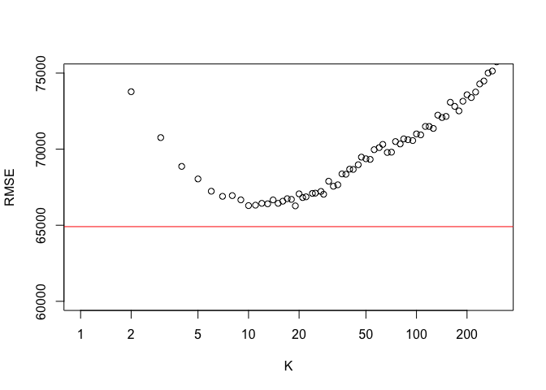

Saratoga Housing Prices
================
Alex Rados

# Overview

The goal at hand is determining a good model for predicting future house
prices in Saratoga, New York in order to know how much to tax property
owners for the local taxing authority.

# Data

We will be looking at past Saratoga housing prices to gather reasonable
expectations of the effects that house characteristics will have on
future price. Some of the variables at hand are age of the house (in
years), percentage of residents in the neighborhood with a college
degree, number of bedrooms and bathrooms, among many others.

Using these variables to fit both linear and non-parametric models, we
are trying to fit the most accurate model when predicting house prices.
This can be measured in the form of the root mean-squared error (RMSE)
of that specific model.

In order to generate the most accurate predictions, however, we can’t
judge it based on past data that we have. Thus, we randomly sampled 80%
of the data at hand and used that as a training set on which we built
our model while using the other 20% as a test set on which we tested our
model to gather a sufficient RMSE. This then allows us to measure the
out-of-sample performance.

Finally, to address the issue of random variation with the selection of
data points that end up in our train/test split, we ran a do-loop. This
averaged the estimate of out-of-sample RMSEs over 500 different random
train/test splits, to which we felt comfortable with the lack of random
variation in the results that were being generated.

# Linear Model

I initially began with a linear model that predicted price using age,
percentage of college graduates in the neighborhood, size of the lot (in
acres), number of bedrooms, bathrooms, and total rooms, living area of
the house (in square feet), number of fireplaces, type of heating
system, type of fuel system, and whether there was central air
conditioning. This produced a lower RMSE, around 66,000, than either a
smaller model (just lot size, bedrooms, and bathrooms) or a larger model
(all these variables and every interaction between them).

    ## [1] 66373.41

Going off this model, we attempted to improve the RMSE through
selections of specific interaction and adding/subtracting variables.
After going through a muiltitude of subtractions, additions, and
interactions, we finally settled on a model that improved the RMSE from
around 66,000 to about 64,000.

First, we made an adjustment to the data in creating an extra rooms
variable that was the total amount of rooms minus the bedrooms and
bathrooms, as before in the regression the variable total rooms would’ve
included two other features already in the model. Thus, we added in
extra rooms and took out the total rooms.

We then added interactions between bedrooms and bathrooms, bathrooms and
extra rooms, and bedrooms and extra rooms. We also included whether
there was new construction on the house, along with whether the property
is on the water front. Adding in new construction and the interactions
improved the RMSE by 300. The most impressive additional variable beyond
the initial model was waterfront, which dropped the RMSE by about 2,000.
This is the linear model that we decided on.

    ## [1] 64301.43

# Non-Parametric Model

Next, we wanted to try to improve upon the linear fit by building a
non-parametric K nearest neighbors model that uses those same variables
to derive better performance. We ran a do-loop around the KNN
assignments in order to get rid of the random variation in terms of
choosing the train/test
splits.

<!-- -->

    ## [1] 75842.67

    ## [1] 64301.43

We found that a non-parametric model was not able to improve upon our
linear fit. The KNN method of modeling resulted in a consistently higher
RMSE, thus showing the use of a linear model compared to a
non-parametric fit in predicting house prices for taxation purposes.

# Conclusion
